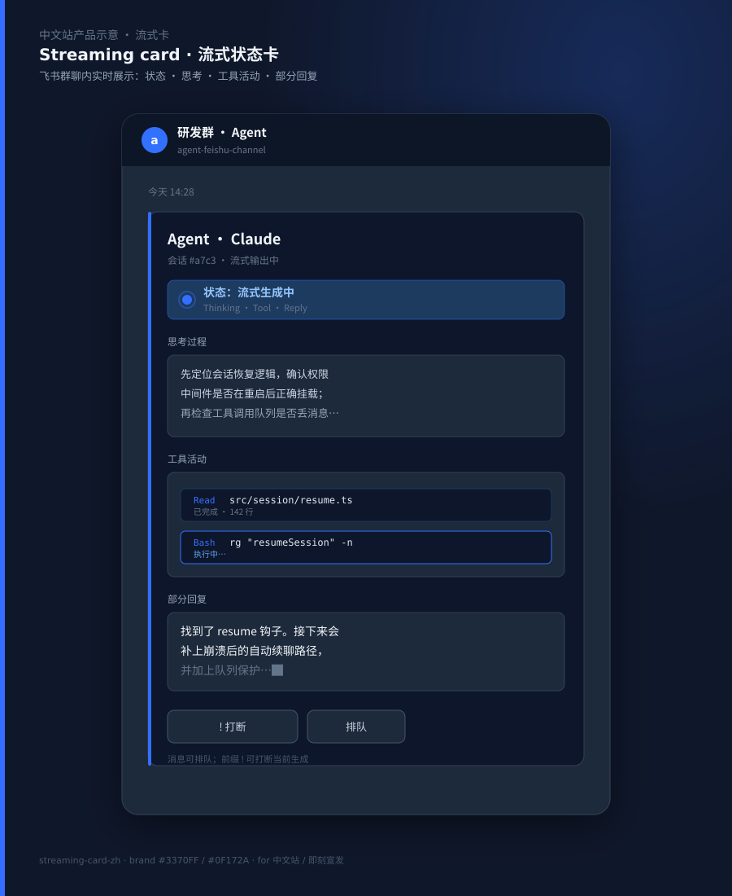
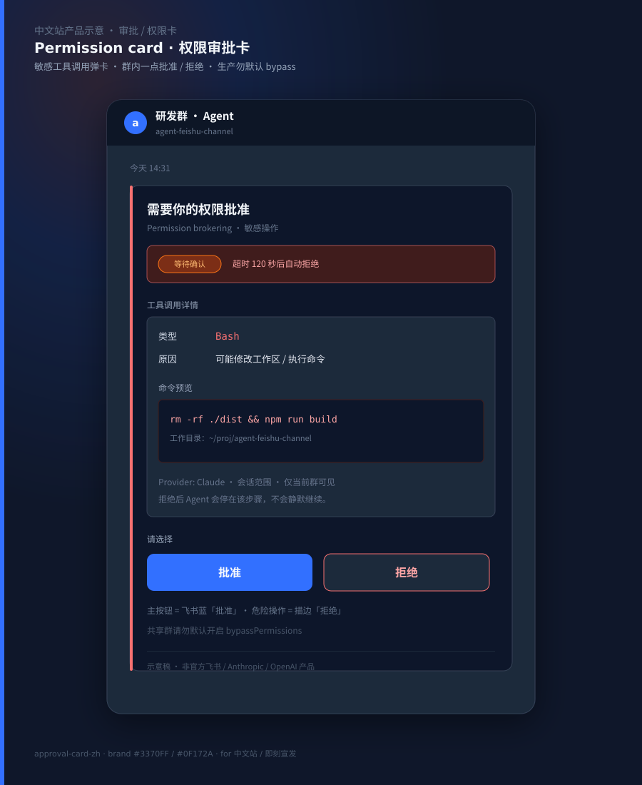
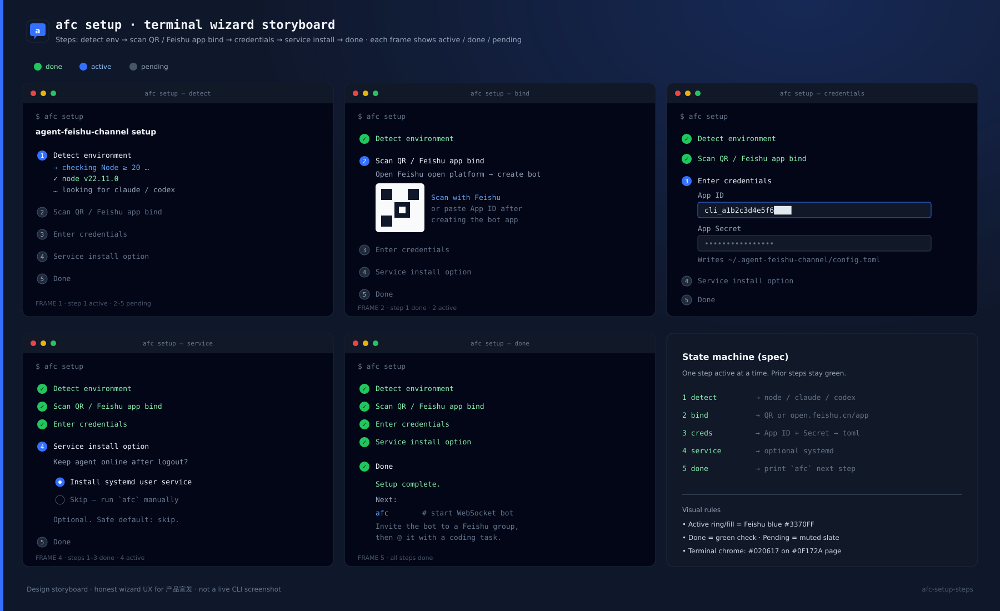
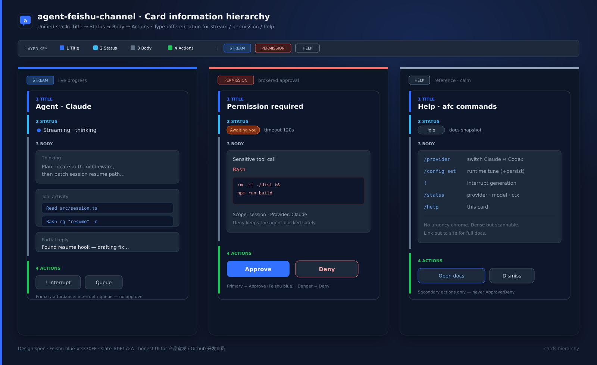

# agent-feishu-channel

<p align="center">
  
</p>

<h1 align="center">agent-feishu-channel</h1>

<p align="center">
  把 Claude 与 Codex <strong>原生接到飞书 / Lark 群聊</strong>。<br />
  完整 coding-agent 工作流 —— 就在你已经在用的飞书群里。
</p>

<p align="center">
  <a href="https://www.npmjs.com/package/agent-feishu-channel"></a>
  <a href="https://www.npmjs.com/package/agent-feishu-channel"></a>
  <a href="https://github.com/Blackman99/agent-feishu-channel/actions/workflows/ci.yml"></a>
  
</p>

> **从 `claude-feishu-channel` 迁移？** 项目已更名以反映多 provider（Claude + Codex）。执行 `pnpm remove claude-feishu-channel && pnpm add agent-feishu-channel`（或 npm 等价命令）。命令由 `cfc` 改为 `afc`。首次运行会把 `~/.claude-feishu-channel/` 自动重命名为 `~/.agent-feishu-channel/`，会话历史保留。配置键不变。

**文档站点：** https://blackman99.github.io/agent-feishu-channel/

**[English](README.md)** | **中文**

---

## 一句话定位（P0）

**先把服务跑起来，再谈命令表。**

我们优先交付的是三件事：

1. **Setup** —— `afc init` + 飞书凭证，几分钟进群可用  
2. **Service** —— WebSocket 常驻、会话持久化、权限审批卡、消息排队 / `!` 打断  
3. **中文文档** —— 本 README + 站点，面向国内飞书团队日常落地  

差异化（相对生态里更重的桥 / 编排器）：**更轻量** · **飞书权限审批卡** · **config 里挂 MCP** —— 不是「再堆一堆 slash command」。

---

## 为什么选它（vs 同类）

| 你想要… | 更合适的方向 |
|---------|--------------|
| 扫码极速上手、PersonalAgent、功能面很大 | [lark-channel-bridge](https://github.com/zarazhangrui/lark-coding-agent-bridge)（社区热度高） |
| 20+ CLI、tmux / Web 终端、多 bot 编排 | [botmux](https://github.com/deepcoldy/botmux) |
| 多 IM（飞书 / 钉钉 / Telegram / 企微…）统一桥 | [cc-connect](https://github.com/chenhg5/cc-connect)（~15k★ 量级，发帖前再核） |
| **飞书群里轻量双 provider + 权限卡 + MCP，服务先稳** | **本项目（agent-feishu-channel）** |

诚实对照见 [docs/comparison-cn.md](docs/comparison-cn.md) 或下方「选型对照」摘要。

---

## 能力一览

- **双 Provider** —— 全局默认 Claude 或 Codex，会话内 `/provider` 切换  
- **完整 coding agent** —— 改文件、跑 shell、搜索、规划  
- **权限经纪（Permission brokering）** —— 敏感 tool call 在飞书发**交互审批卡**，你点了才继续  
- **会话持久化** —— 进程重启后续聊，自动恢复  
- **排队与打断** —— 生成中消息入队；`!` 前缀打断并改道  
- **交互卡片** —— 流式状态、tool 活动、thinking、权限  
- **上下文分级兜底** —— 先 warn，再走 50MB hard-reset 回退  
- **运行时配置** —— `/config set` 热改，不必重启  
- **MCP** —— `config.toml` 里 `[[mcp]]` 数组，stdio / sse 挂给当前 provider  


<p align="center">
  
</p>


<p align="center">
  
</p>


---

## 快速开始（Setup → Service）

### 前置

- **Node.js** ≥ 20  
- **Claude CLI** —— 使用 Claude 时 `$PATH` 中有 `claude`  
- **Codex CLI + SDK** —— 使用 Codex 时 `$PATH` 中有 `codex`，并安装 `@openai/codex-sdk`  
- **飞书机器人应用** —— 在 [open.feishu.cn](https://open.feishu.cn/app) 创建  

### 安装

```bash
npm install -g agent-feishu-channel
```

### 初始化配置

```bash
afc init
# 在 ~/.agent-feishu-channel/config.toml 生成模板
```

编辑配置，填入飞书凭证：

```bash
vim ~/.agent-feishu-channel/config.toml
```

首次拿自己的 `open_id`：临时设 `allowed_open_ids = []` 且 `unauthorized_behavior = "reject"`，给机器人发一条消息，它会回你的 `open_id`；加进 `allowed_open_ids` 后改回 `"ignore"` 即可日常使用。

### 启动服务

```bash
afc
```

机器人通过 **WebSocket** 连接飞书并开始收消息。先确认：**私聊或群里 @ 机器人能通 → 权限卡能弹 → 会话重启后还在**。命令表是第二步。


<p align="center">
  
</p>


### CLI

```
afc [options]            启动服务
afc init                 在 ~/.agent-feishu-channel/config.toml 创建配置模板

Options:
  -c, --config <path>    指定 config.toml（覆盖默认路径）
  -v, --version          版本号
  -h, --help             帮助
```

环境变量：`AGENT_FEISHU_CONFIG`（覆盖配置路径）；`CLAUDE_FEISHU_CONFIG` 为旧别名，仍可用。Claude 自定义端点可用 `ANTHROPIC_BASE_URL` / `ANTHROPIC_AUTH_TOKEN`。

---

## 群里怎么用（先服务，后命令）

**日常输入：**

| 输入 | 效果 |
|------|------|
| 普通文本 | 空闲则立刻开一轮；生成中则入队 |
| `!<text>` | 打断当前轮，并以 `<text>` 开新轮 |

**常用命令（完整表见英文 README / `/help`）：**

| 命令 | 说明 |
|------|------|
| `/new` | 新会话（清上下文） |
| `/stop` | 打断当前生成 |
| `/status` | 会话状态、模型、reasoning effort、token |
| `/provider <claude\|codex>` | 切换当前会话 provider |
| `/mode <mode>` | 权限模式：`default` / `acceptEdits` / `plan` / `bypassPermissions` |
| `/cd <path>` | 切换工作目录（带确认卡） |
| `/project <alias>` | 切到配置的项目别名 |
| `/config set <key> <value>` | 运行时改配置；加 `--persist` 写回 toml |
| `/help` | 命令列表 |

生产群聊建议：**不要默认 `bypassPermissions`**。让审批卡发挥作用。

---

## 配置要点

完整注释见 [`config.example.toml`](config.example.toml)。

| 段 | 用途 |
|----|------|
| `[feishu]` | `app_id` / `app_secret` / `encrypt_key` / `verification_token` |
| `[access]` | `allowed_open_ids`、`unauthorized_behavior` |
| `[agent]` | 默认 provider、cwd、权限模式、权限超时 |
| `[claude]` / `[codex]` | 各 provider 默认模型、effort、权限等 |
| `[render]` | 卡片渲染（thinking、turn stats、inline 上限） |
| `[persistence]` | 状态文件、日志、session TTL |
| `[projects]` | 项目别名 → 路径 |
| `[[mcp]]` | MCP：`name`、`type`（`stdio`/`sse`）、`command`/`args`/`env` 或 `url` |

旧 Claude-only 配置仍可加载；缺 `[agent]` 时会用 legacy `[claude]` 作共享回退，Codex 给安全默认（如 `gpt-5.5`、`high` effort）。可用 `/config set ... --persist` 逐步迁到新布局。

---

## 架构（简图）

```
飞书 WebSocket
      │
      ▼
FeishuGateway（解密、去重、访问控制）
      │
      ├─ onMessage ──▶ 路由
      │                    ├─ /command ──▶ CommandDispatcher
      │                    └─ 普通文本 ──▶ Session.submit → Claude / Codex
      │                                        ├─ tool_use ──▶ PermissionBroker ──▶ 飞书审批卡
      │                                        ├─ thinking ──▶ 流式卡片
      │                                        └─ text ──▶ 回答卡
      └─ onCardAction ──▶ 权限 / 问答 / /cd 确认 解析
```

上下文：先 **warn**，再 **50MB hard-reset 回退**；用 `/context` 查看窗口占用与兜底顺序。

**Codex 当前限制：** 回合中途 `acceptEdits` 升级在 Codex 适配层仍是安全 no-op（`setPermissionMode()`）。

---

---

## 卡片层级（产品示意）

流式卡 / 权限审批卡 / 帮助卡共用同一信息层级：标题 → 状态 → 正文 → 操作。权限卡是飞书群里的一等公民——敏感 tool 要你点批准才继续。

<p align="center">
  
</p>


## 选型对照（摘要）

| 维度 | agent-feishu-channel | lark-channel-bridge | botmux | cc-connect |
|------|----------------------|---------------------|--------|------------|
| 重心 | 飞书原生服务 + 权限卡 + MCP | 扫码上手、功能丰富的飞书桥 | 多 CLI 编排 / 终端投影 | 多 IM 平台桥 |
| Provider | Claude + Codex | Claude + Codex | 20+ CLI / Agent | 以 Claude Code 等为主，平台面广 |
| 权限 | 飞书交互审批卡（经纪） | 有权限/管理模式（实现不同） | 多依赖 CLI 原生权限 + 卡片/终端 | 有 PermissionRequest 等钩子 |
| MCP | `[[mcp]]` 写进 config | 视版本 / 文档 | 一般不重造 MCP 层 | 走 Claude Code / 生态侧 |
| 体量感 | **刻意轻**：服务稳优先 | 社区星多、能力面大 | 偏「编排器 / daemon」 | 偏「跨平台连接器」 |
| 上手 | `afc init` + 开放平台凭证 | 扫码 PersonalAgent 向导 | `botmux setup` + 多适配器 | `cc-connect feishu setup` 等 |

详细诚实对照 → 见 [docs/comparison-cn.md](docs/comparison-cn.md)。

---

## 开发

```bash
git clone https://github.com/Blackman99/agent-feishu-channel.git
cd agent-feishu-channel
pnpm install
pnpm dev      # 开发
pnpm test
pnpm typecheck
pnpm build
```

---

## 许可

MIT

---

## 中文落地提示（可删小节，发帖时保留精神）

- **先演示 Setup + 审批卡 + 重启续聊**，不要先甩完整命令表。  
- 飞书生态群强调：开放平台 Bot + WebSocket + 交互卡片，而不是「又一个 slash 菜单」。  
- 对比大仓（如 ~2.5k★ 的 bridge、~15k★ 量级的 cc-connect）时：**承认对方上手快 / 功能面大 / 跨平台**，再讲本仓库「轻 + 权限卡 + MCP」——不贬低、不虚报星数（发帖前再核）。  
